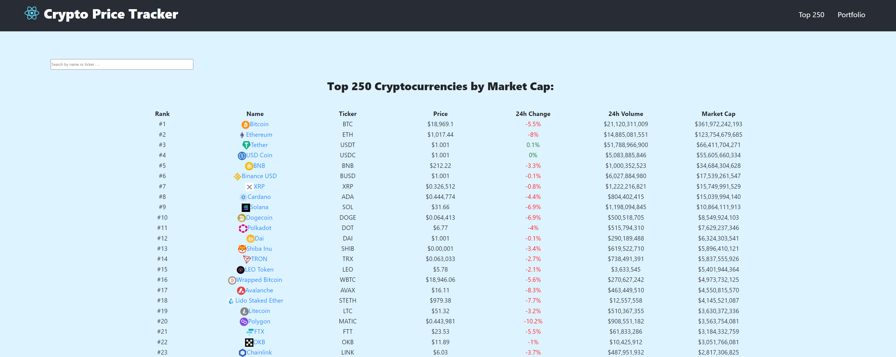

# Crypto Tracker
Is an app that allows users to track their portfolio of crypto assets. Users can login to see their portfolio, they can add new assets or remove them, like in Coin Market Cap. They can also see all statistics for top 250 crypto coins.

Please leave a ⭐ if you like it.

## Try It Out
You can try it yourself [here](https://tijan.dev/crypto-tracker).

If you find any **errors** ⛔, please report them to [errors@tijan.dev](mailto:errors@tijan.dev) thanks 🙏.

## Technologies
For this project I used:
- [React](https://reactjs.org/)
- [Moralis](https://moralis.io/) for authentication and database
- [Coingecko API](https://www.coingecko.com/en/api/documentation) for markets data

## About Me
Hi! 👋 I'm Tijan, passionate **blockchain developer** from Slovenia. Take a look at my [portfolio](https://tijan.dev).

You can get in touch with me through my [website](https://tijan.dev) or contact me on [twitter](https://twitter.com/0xTijan).

Do you like my work? You can support me by donating to this address: 0xC4C6A0bc6648a4F343bd86D7C48C9967530fbB48

## License
[MIT](https://choosealicense.com/licenses/mit/)